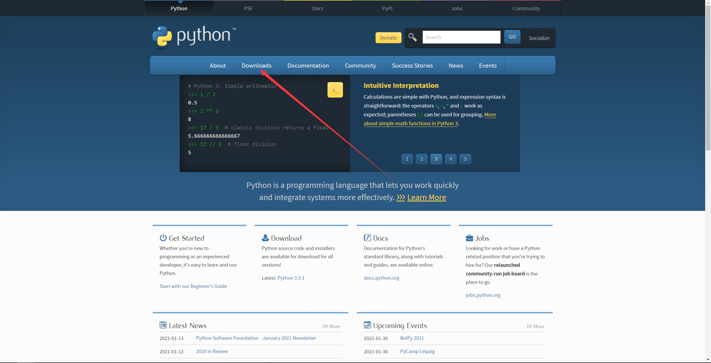
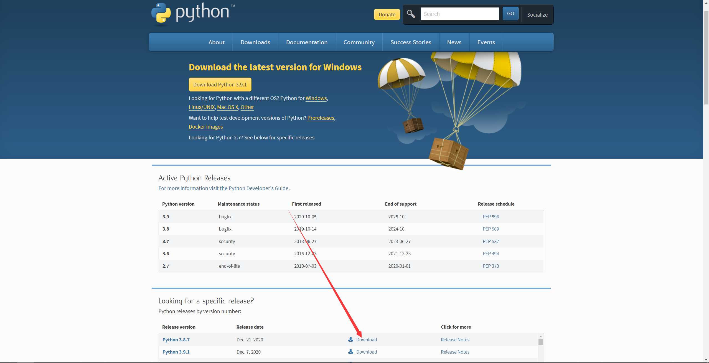
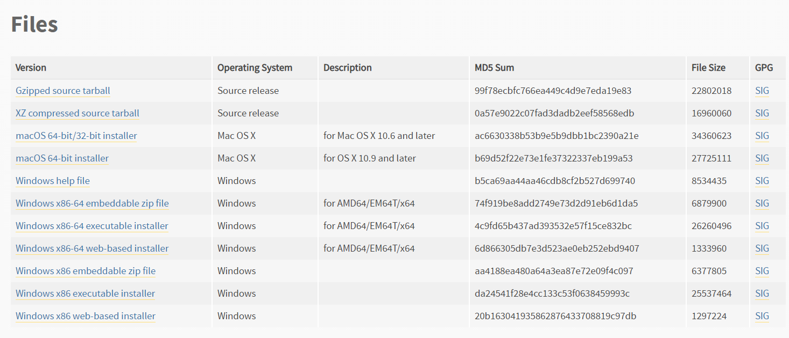
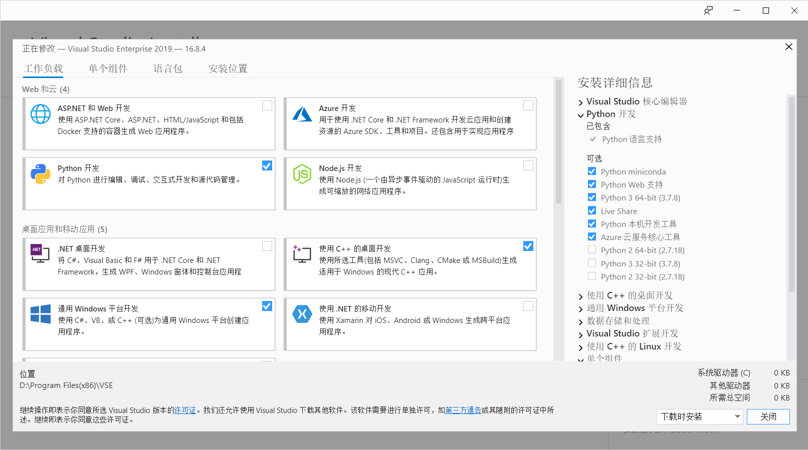
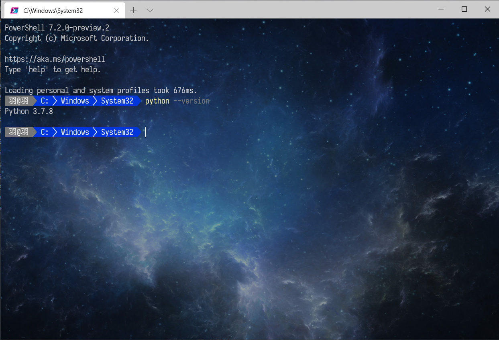


# 关于配置**Python**

---

## 安装*Python*

1. 官网下载*Python*

    <https://www.python.org/>

    上面是*Python*的官网，进去后如下图所示

    

    单击箭头所指的Download，进入如下页面

    

    然后再点击所需版本后的Download

    

    打开后的页面翻至最底

    各文件的区别：

    > 1. *Windows x86-64 web-based installer*：在线安装,下载的是一个exe可执行程序，双击后，该程序自动下载安装文件（所以需要有网络）进行安装
    >
    > 2. *Windows x86-64 executable installer*：程序安装。下载的是一个exe可执行程序，双击进行安装
    >
    > 3. *Windows x86-64 embeddable zip file*：解压安装。下载的是一个压缩文件，解压后即表示安装完成
    >
    > 4. *Windows x86*：适用32位windows操作系统
    >
    > 5. *Windows x86-64*：适用64位windows操作系统。

2. 通过*Visual Studio 2019*安装

    勾选*Python*工作负载后执行安装，会自动安装所选版本

    

3. 通过*Microsoft Store*安装

    直接搜索*Python*，选择版本进行安装

---

## 环境变量

1. 将*Python*所在文件夹添加至系统PATH，例如

    >D:\Program Files (x86)\Microsoft Visual Studio\Shared\Python37_64

2. 将*Python*安装路径的*Scripts*文件夹添加至系统PATH，例如

    >D:\Program Files (x86)\Microsoft Visual Studio\Shared\Python37_64\Scripts

3. 将*Python*依赖包的*Scripts*文件夹添加至系统PATH，例如

    >C:\Users\10362\AppData\Roaming\Python\Python37\Scripts

4. 配置完成后进入*cmd*输入`python --version`检测是否配置成功

    如下图，我使用的是*Windows terminal*和*Power Shell*（后面也出一篇这个配置教程）

    

---

## 依赖包

1. *requirements.txt*中存放依赖包列表

    使用`pip freeze > requirements.txt`命令生成*requirements.txt*文件
    每次修改依赖包后都生成一次依赖包列表

2. 安装依赖包

    使用`pip install XXX`进行依赖包的安装，单独这样会很满，使用镜像加速
    >镜像链接
    >><https://mirrors.aliyun.com/pypi/simple/>
    >>
    >><https://pypi.tuna.tsinghua.edu.cn/simple>
    >>
    >><http://pypi.doubanio.com/simple/>
    >>
    >><https://pypi.mirrors.ustc.edu.cn/simple/>

    使用`pip install XXX -i https://pypi.tuna.tsinghua.edu.cn/simple`进行镜像加速安装

    使用`pip install -r requirements.txt -i https://pypi.tuna.tsinghua.edu.cn/simple`从*requirements.txt*中批量安装依赖包

3. 更新依赖包

    使用`pip list --outdated`获取更新列表

    再使用`pip install --upgrade XXX -i https://pypi.tuna.tsinghua.edu.cn/simple`
    进行镜像加速更新依赖包
